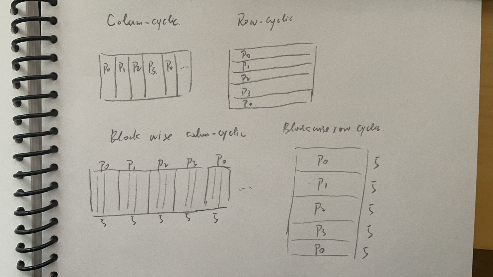

# Problem Session 1 HT23 Parallel Programming Models

+ Name: hongguang Chen
+ CID： chenhon
  
## Problem 1

+ ### questiona a
<!-- why？ -->
Blockwise will achieve the best locality.
Becasue the cache line size is 64 Bytes. To minimize cache misses, data accesses should be as contiguous as possible.

+ ### question b
in order to fully use all processor, task size should be $\frac{N}{P}$, so:
$$granularity = N/(P*M), M=1$$


+ ### question c
The coarsetst grnularity task size should be $\frac{N}{P}$.
And the execution time should be:
$$ E_t = T_{schedual} +\frac{N}{P} * T_{computation}$$
when $P=8$, $T_{computation}=1ms$, $N=10^6$
we can get:
$$E_t = 1+ 10^{-3} * \frac{10^6}{8} = 1+ 125 =126ms$$
<!-- # why just 1 ms for schedualing ? -->

+ ### question d
According to the question c, when P = 10000, then
we have:
$$E_t = 1 + 10^{-3}* \frac{10^6}{10^4} = 101ms$$

+ ### question e
<!-- why? -->
if we want schedualing time less than 10%.
we will have：$ \frac{T_{scheduling}}{E_t} < 0.1$
Because:
 $$E_t = N_{task} * 1\mu s + T_{scheduling},  (T_{scheduling} =1ms)$$
So we will have:
  $$ 10 ms > E_t → N_{task} * 1\mu > 9 ms$$
And because:
  $$N_{task} =granularity= \frac{N}{P}$$
So:
  $$ P \le \frac{10^6}{9*10^3} = 111 $$

+ ### question f
<!-- why dynamic ? -->
<!-- granularity=100,
task = N/G = 10^6 / 10^2 = 10^4
10^4/ P = 10^2 ms
10^2 x 2 ms + 100* 100* 10^-3  =200 + 10 =210 ms -->
<!-- 10000 个任务  每个核心算 100 个任务 -->
for convience, let granularity = 100.
When P = 100, then:
$$E_t = \frac{N}{g*P}* 2ms  + g * \frac{N}{g*P} * 10^{-3} = 210ms $$

## Problem 2

For shared memory case:

a) A(P_0) B(P_0) C(P_0) -> 30ms
b) A(P_0) B(P_1) C(P_0) -> 10 + 15 = 25ms

For distributed system case:
<!-- ? why 15 -->
c) A(P_0) B(P_0) C(P_0) -> 30ms
d) A(P_0) B(P_1) C(P_0)
10 + 1000*8/2/10^6 * 2 *10^3 + 15 = 33ms


## Problem 3
### q1 yes
a and b are independent

### q2 yes 
it can be rewritten as:
```
for (i=0;i<N-1l; i++){
  b[i] = a[i+1]
}
for (i=0;i<N-1;i++){
  c[i] = a[i] + b[i]
}
```

### q3 yes
it can be rewritten as:
```
for (int i=1; i<N; i++){
  c[i]= c[i-1];
}
for (int i=1; i<N; i++){
  c[i]+=a[i]
}
```

## Problem 4
### a
g = 1000/1 = 1000
When P = 10:
$$E_t = g/P + T_{context switch} + T_{create} = 100 + 900*2us+ 100* 10us = 102.8 ms $$

When P = 1000:
$$ E_t = 10 + 9* 2us + 10*10us$$
### b
When thread granularity of 1ms
g=1000/0.001 = 10,000,000
When P=10
$$E_t = 10^5 + 10^5 * 10us$$
When P=1000
$$E_t = 10^3 + 10^3 * 10us$$

## Problem 5
assume P=4


## Problem 6
```cpp
for(int i=0, i<3*3*5;i++){
  a[i/(3*5)][i/5%3][i%5] =
     a[i/(3*5)+1][i/5%3+1][i%5] +1;
}
```

## Problem 7
```
// tile and interchange j first
for(jt=0;jt<10;jt+=tile_size)
  for(i=1;i<10;i++)
    for(j=jt; min(jt+1,10);j++)
      a[i][j]=a[i][j-1]+b[i][j];

// then tile and interchange i
for(it=0;it<10;it+=tile_size)
  for(jt=0;jt<10;jt+=tile_size)
    for(i=it;i<min(it+tile_size,10),;i++)
      for(j=jt; min(jt+tile_size,10);j++)
        a[i][j]=a[i][j-1]+b[i][j];
```